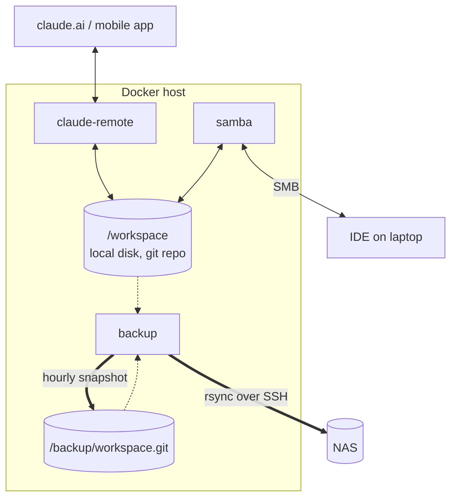

# ai-workspace-remote

An always-on, remotely accessible home for an
[ai-workspace](https://github.com/sebmartin/ai-workspace-plugin) containing the markdown
context across your threads that Claude Code works in.

A workspace like that is just plain files on disk. If that disk is your laptop,
the workspace is only available when the laptop is open and with you: you
cannot pick up a thread from your phone, a second machine sees nothing, and
whether any of it is backed up is a question you would rather not have to
answer.

Move it to a machine that is always running and those problems go away:

- **Work on it from anywhere.** Claude Code runs there in remote-control mode,
  so you drive it from claude.ai or the mobile app, and the session keeps
  going whether or not your laptop is awake.
- **Still just files.** The workspace is exported over SMB, so you browse and
  edit it from a desktop with any editor, exactly as if it were local.
- **Backed up off the box.** A git snapshot goes to a second machine over SSH
  on a schedule, to a NAS or anything else you can rsync to.
- **Not corrupted.** The agent works on local disk, not a network mount. A
  workspace is a git repo, and git over SMB or NFS gets stale `.lock` files
  and non-atomic renames. That damage is silent, and you find it when you
  need the history. Local disk is also much faster.

It is implemented as three containers, Claude Code, Samba and a backup
scheduler, sharing one workspace directory and deployed with Docker Compose.



Solid arrows are writes, dotted are reads.

Session transcripts live in Claude's home rather than the workspace, so the
backup container mirrors those to the NAS separately.

## Design constraints

**Nothing is installed on the Docker host.** The backup jobs, the scheduler
and the Samba server all run in containers. There is no host cron, no host
smbd, no host git hook.

**Everything machine-specific lives in `.env` and `secrets/`.** The committed
files carry no paths, hostnames, users or ids from any particular machine.

**It runs from a checkout on the Docker host.** `make up` builds and starts.
There is no registry and no separate image-publishing step.

## Requirements

- A Linux Docker host with Compose v2.
- A workspace directory that is already a git repository.
- Somewhere to back up to, reachable over SSH. Any box that accepts rsync.
- An `amd64` host. The backup image pins supercronic to that architecture;
  building elsewhere means changing two build args in `backup/Dockerfile`.
- `jq` on the host if you want `make plugins`.

## Quick start

Clone this onto the Docker host and run it there.

```bash
git clone https://github.com/sebmartin/ai-workspace-remote.git
cd ai-workspace-remote
cp .env.example .env
$EDITOR .env               # see "Required settings" below

make dirs                  # create host paths with the right ownership
make smb-password          # generate the SMB password, prints it once
make up                    # builds the images and starts the stack
make login                 # one-time: run /login inside the container
```

That gives you two ways in, independent of each other. Use either, or both.

- **claude.ai or the mobile app**, to work with the agent. The device shows
  up once the container is running.
- **`smb://<host>/workspace`**, to read and edit the files by hand in Finder
  or an editor. Skip it if you never want to touch the files directly.

### Required settings

| variable | what it is |
|---|---|
| `WORKSPACE_HOST_PATH` | the workspace tree, a git repo |
| `CLAUDE_HOME_HOST_PATH` | Claude Code's home: auth, transcripts, plugins |
| `BACKUP_STATE_HOST_PATH` | local bare repo, locks, job heartbeats |
| `WORKSPACE_UID` / `WORKSPACE_GID` | owner of all three, and the uid every container aligns to |
| `SMB_PASSWORD_FILE` | path to a file holding the share password |
| `NAS_HOST` / `NAS_USER` / `NAS_PATH` / `NAS_TRANSCRIPTS_PATH` | backup destination |

## First run checklist

These are the things that otherwise cost an hour.

1. **Ownership.** All three host directories must be owned by
   `WORKSPACE_UID:WORKSPACE_GID`. `make dirs` does it.

2. **Log in once.** `make login` drops you into Claude inside the container.
   Run `/login`, and accept the workspace trust prompt. Both persist in the
   mounted `.claude`.

   `.claude.json` must exist as a file on the host before the first start,
   or Docker creates a directory there and Claude fails confusingly.
   `make dirs` creates it.

3. **The backup path's parent must exist on the NAS.** rsync creates only the
   final component, so `mkdir -p` the directory above `NAS_PATH` and
   `NAS_TRANSCRIPTS_PATH` before the first mirror.

4. **SSH key for the NAS.** A dedicated passphraseless key, and a populated
   known_hosts, because `StrictHostKeyChecking` is on and a cron job cannot
   answer a trust prompt:

   ```bash
   mkdir -p secrets
   ssh-keygen -t ed25519 -N '' -f secrets/id_backup
   ssh-keyscan -p 22 nas.example > secrets/known_hosts
   ssh-copy-id -i secrets/id_backup.pub backup@nas.example
   ```

   Consider restricting the key on the NAS side with a `command=` prefix in
   `authorized_keys` so it can only run rsync into the backup path.

5. **The workspace filesystem must support extended attributes.** ext4, xfs
   and btrfs are fine. Samba's `streams_xattr` needs `user.*` xattrs, so
   pointing `WORKSPACE_HOST_PATH` at an NFS mount would break the share.

6. **Add a `.gitignore` to the workspace** before the commit job starts, or
   the backup history fills up with `.DS_Store` and editor state churn.

## Connecting over SMB

The share is tuned for macOS and Linux clients. SMB3 is the floor and
encryption is required, which both handle natively.

On macOS, connect with **⌘K → `smb://<host>/workspace`**, user `claude`. The
share will not appear in Finder's sidebar. That is deliberate: NetBIOS is
disabled and there is nothing to discover. Adding Avahi would need host
networking, which conflicts with publishing port 445 explicitly.

Do not disable SMB signing or encryption on the client to "fix" performance.

**Windows.** Nothing here blocks a Windows client. `vfs_fruit` only engages
when a client negotiates the Apple extensions, so it stays out of the way.
Two things in [samba/smb.conf](samba/smb.conf) are worth changing
if Windows is a first-class client: add `Thumbs.db` and `desktop.ini` to
`veto files`, and lower `server min protocol` if you need to support anything
older than Windows 8, which is where SMB3 and encryption arrived.

## Plugins, and pinning one to a branch

Claude installs plugins as `name@marketplace`, only from a registered
marketplace, never straight from a repo URL, and nothing in the CLI takes a
git ref. So the container keeps its own single-entry marketplace on disk and
writes the repo and ref into its manifest. It is rebuilt on every start, so
switching refs needs no cleanup.

The plugin is installed on every start. `PLUGIN_REPO` and `PLUGIN_NAME`
default to the ai-workspace plugin, so the only thing you normally set is the
ref:

```bash
PLUGIN_REF=my-big-revamp        # branch, tag or sha; empty for the default branch
```

```bash
docker compose up -d            # recreate with the new setting
make plugins                    # confirm what is actually live
```

Claude Code does the fetching and caches by resolved sha. Clear `PLUGIN_REF`
and redeploy to go back to the default branch.

Any other plugins you want are installed by hand inside the container with
`claude plugin`, and persist in the mounted `.claude`.

## The device name in claude.ai

The device name is the **container hostname**. Claude Code sends
`os.hostname()` as `machine_name` when it registers, and no environment
variable or config key overrides it. Leave the hostname unset and you get
Docker's generated container ID, which is where a bare hex string comes from.

`CLAUDE_HOSTNAME` sets it. Hostname is fixed when the container is created,
so changing it needs a recreate (`docker compose up -d`), not a restart.

The registration also carries the working directory, so if you ever run a
second stack against a different workspace, give it its own `CLAUDE_HOSTNAME`
or the two are hard to tell apart.

Auto-generated *session* names inside that device get the hostname as a
prefix too, which falls out of the same setting.

## Session survival across restarts

`docker compose restart claude-remote` brings back the sessions the previous
server was serving, for roughly four hours after it stopped. Three things
make that work, and all three are easy to break:

- **The workspace is mounted at `/workspace` and that path is fixed.**
  Transcripts are stored under a directory keyed on the working directory
  with `/` replaced by `-`, so `/workspace` becomes `-workspace`. It is
  hardcoded rather than offered as a setting, because changing it would
  orphan every existing session.
- **`~/.claude` and `~/.claude.json` are persisted.** Transcripts,
  credentials and plugin state live in the first, onboarding and trust in the
  second. `~/.local` is not persisted, so a recreate reverts Claude to the
  image's version.
- **`init: true` plus `exec`.** Without tini, `claude` is PID 1 and discards
  SIGTERM, so every stop waits out the grace period and then SIGKILLs
  mid-transcript.

The entrypoint never passes `--no-create-session-in-dir`, which would forfeit
the re-serve behaviour, and leaves `--name` unset by default for the same
reason.

Check what is on disk with:

```bash
docker compose exec claude-remote ls ~/.claude/projects/-workspace/
```

### How the home is mounted, and the hazard in it

Two paths are bind-mounted individually, `~/.claude` and `~/.claude.json`,
rather than the home directory as a whole. Mounting the whole home would be
better in one respect and impossible in another: it would hide
`/home/claude/.local`, where the image installs Claude and `uv`, and the
container would come up with no `claude` on `PATH`. Claude's native installer
only ever installs into `$HOME` and takes no install-dir override, so there is
no quick way around that.

The cost is real and worth knowing. `~/.claude.json` is rewritten atomically,
as write-temp-then-`rename`. A single-file bind mount pins an *inode*, and
`rename` installs a new one, so after the first rewrite the container can be
reading the old orphaned inode while the host has the new file. This is the
same shape the previous setup ran with, so it is a known-lived-with hazard
rather than a new one, but it is a hazard.

Two consequences follow from `~/.local` not being persisted:

- A `docker compose up -d` recreate reverts Claude to the version baked into
  the image, discarding any background auto-update. Since the README tells you
  to recreate whenever `CLAUDE_HOSTNAME` changes, expect that.
- `make rebuild` is how you actually move the baked-in version forward.

The fix, when it is worth the effort, is to install Claude and `uv` outside
the home and mount the home as one directory.

## Backup and restore

Four jobs, run by supercronic inside the backup container as the workspace
uid, so nothing it writes is root-owned.

| job | default | what it does |
|---|---|---|
| `commit` | hourly | push every branch, plus a `backup` ref holding uncommitted work |
| `mirror` | hourly | rsync the bare repo to the NAS over SSH |
| `transcripts` | hourly | rsync session transcripts to the NAS |
| `maintain` | weekly | `git gc` both repos, then a full `git fsck` |

**Uncommitted work goes on a `backup` ref that is rewritten, not appended
to.** It is always exactly `HEAD` plus one commit containing whatever is not
committed yet, so the only blobs it keeps alive are the current uncommitted
diff. Yesterday's half-finished edits become unreachable the moment the ref
moves, and the weekly `gc` reclaims them. When the worktree is clean the ref
just points at `HEAD`.

That reclamation is immediate in the bare repo. In the workspace repo the same
`gc` uses git's default two-week prune expiry, because the lock only
serialises this container's own jobs and you may be running git in there at
the time, so superseded objects linger a little longer on that side.

That bounds the cost. A naive append-only snapshot chain would keep every
intermediate state the agent ever wrote, forever, and the only way back would
be rewriting history. Here nothing accumulates, so the schedule is free to be
as frequent as you like.

An idle tick does nothing at all. Both commit dates are pinned to the
parent's and the message carries no timestamp, so an unchanged tree hashes to
the same commit every run. The ref does not move, the push is a no-op and the
mirror has nothing to ship, with no bookkeeping needed to work that out.

The job uses git plumbing against a private index, so it never touches your
checked-out branch, your index or `HEAD`, and cannot collide with a git
command you run in the workspace. It pushes to the bare repo by path rather
than through a configured remote, because a remote keeps a tracking ref whose
reflog records every force-push, and those entries would hold every
superseded commit alive in the workspace repo.

The `backup` ref is force-pushed first, then real branches with `--all`,
fast-forward only. Order matters: `--all` legitimately fails after you amend
or rebase a branch that has already been backed up, and pushing it first would
take the snapshot down with it. The job refuses to run if a local branch named
`backup` exists, since that would collide with the ref it force-pushes.

`push --all` runs on every tick, because a commit you make by hand moves a
ref without touching a single file and would otherwise never leave this disk.
It is a no-op when there is nothing new. The job also keeps the bare repo's
`HEAD` pointing at the same branch as the workspace, since `git init --bare`
leaves it at `refs/heads/master` and a clone of the restored copy would
otherwise check out nothing.

**The backup target only has to accept rsync.** All the git work happens on
local disk and the NAS receives plain files it never interprets, so it needs
nothing installed and git's locking never touches a network filesystem.

**The mirror runs in two passes**, objects before refs. A single
`rsync --delete` over a live git directory can copy `refs/` before the objects
they point at, or delete a pack the new refs still need, leaving the copy
unclonable, and permanently so if the source disk dies inside that window.

**The weekly fsck is not optional.** rsync replicates corruption as faithfully
as it does data, and nothing on the NAS side would ever notice. A failed fsck
writes a `corrupt` marker that blocks mirroring until a human clears it,
preserving the last known-good copy.

**Failures are loud.** No job reports success it has not verified. Each one
exits non-zero on failure, supercronic prints that with the job name and exit
code, and the container's healthcheck reports unhealthy when a job has not
succeeded within its staleness window. A 3am failure shows up as an unhealthy
container rather than in a log nobody reads.

### Transcripts are handled separately, and carefully

Session transcripts live in Claude's home, not the workspace, so the git
backup does not cover them. They go to the NAS by rsync rather than into git:
they are append-only JSONL that grow steadily, and committing them every
cycle would store a fresh full blob of a growing file each time.

**The rsync filter is an allowlist ending in `--exclude='*'`.** An exclude
list would be correct only for the files that exist today and would silently
start copying anything a future release adds to `~/.claude`. Copied:
`projects/`, `todos/`, `file-history/`, `history.jsonl`, and the two small
plugin manifests. Everything else is excluded by default, including
`.credentials.json`, `settings.json` (which can carry an `env` block with API
keys) and the plugin cache.

No environment variable widens that set. The paths are hardcoded in the
script, the source is mounted read-only, and before every real run a
`--dry-run` pass checks what rsync intends to send and aborts the job if any
filename looks like credential material. Nothing transfers if that trips.

There is no `--delete` on this job: if Claude prunes an old session locally
you still want the copy, which is exactly the case it insures against. The
archive grows, so keep an eye on it.

### Restoring

What lands on the NAS is a bare git repository. Rsync it back and clone it.
Try that once before you trust any of this.

## Operations

```bash
make ps          # container status, plus the backup container's health
make logs        # follow
make restart     # restart claude-remote, which is the whole update ritual
make plugins     # which plugin version and ref is live
make backup-now  # force a snapshot and a mirror
make rebuild     # refresh base images and apt packages
make check       # validate the compose file and the shell scripts
make env         # keys in .env.example missing from your .env
```

`make up` builds anything stale and starts the stack, so it is also how you
apply a change to a Dockerfile or an entrypoint.

Use `docker compose exec`, never `docker attach`. Attaching to a `tty: true`
container running the remote-control server drops you into its stdio, and a
stray Ctrl+C stops the server and kills live sessions.

Claude Code auto-updates in the background on the stable channel and the new
version takes effect on next process start, so `make restart` is the update.
Base images, apt packages and `uv` are not covered by that. Run `make rebuild`
occasionally.

## Migrating an existing workspace

If you already have a workspace somewhere else - a laptop directory, a network
share - move it in rather than starting empty.

1. Stop anything that writes to it, and unmount it everywhere it is mounted,
   so nothing writes into the source mid-copy.
2. `rsync -a` the old workspace to `WORKSPACE_HOST_PATH`, then `chown -R` it.
3. Run `git status && git log --oneline -5 && git fsck`. All clean before you
   go on. Then `git gc`. A repo that has lived on a network filesystem for
   months will usually repack down a long way.
4. Add a `.gitignore` to the workspace.
5. Move the old `~/.claude` and `~/.claude.json` into `CLAUDE_HOME_HOST_PATH`
   so auth, sessions and plugin state carry over.
6. `make up`, then work through the checks above.
7. Only then rename the old copy rather than deleting it, and leave it a week.

## Known limitations

**Two uncoordinated writers.** Claude and whoever is editing over SMB can
both write the same file.
Oplocks and SMB2 leases are disabled so a client cannot serve stale cached
data for a tree the container writes behind Samba's back, but that prevents
stale reads, not lost updates. There is no fix at this layer. The hourly
snapshot is the safety net.

**The agent can delete the workspace's git history.** `.git` lives inside the
tree and the backup container runs as the same uid Claude does, so nothing
prevents it. The bare repo on the same disk and the NAS copy, up to an hour
stale, are the recovery. Moving the git directory somewhere the session cannot
reach is real work and is deferred.

**One disk holds the live copy.** The Docker host's disk is a single point of
failure. The backup is an hourly RPO plus git's integrity checking, not
replication. That is a reasonable trade for text you can regenerate a few
minutes of, and a bad one if you were expecting redundancy. If the workspace
previously lived on a NAS with RAID, be aware you have traded that for this.

**`secrets/` and `.env` are the security perimeter.** `secrets/` holds the
SMB password and the NAS SSH key, `.env` holds paths and hostnames. Both are
gitignored.

## Troubleshooting

| symptom | cause |
|---|---|
| Device shows as a hex ID in claude.ai | `CLAUDE_HOSTNAME` unset, or the container was restarted rather than recreated |
| Sessions do not come back after a restart | more than ~4h elapsed |
| `make plugins` shows `enabled: false` | the same plugin name is installed from two marketplaces |
| Stop takes the full grace period | SIGTERM is not reaching claude, check `init: true` |
| Share not visible in Finder | expected, connect with ⌘K, there is no discovery |
| Backup container unhealthy | a job has not succeeded in its window, or the bare repo is marked corrupt. Check `make logs` |
| `guard_tripped` in the logs | the transcript filter would have sent credential material, so nothing was transferred |

## License

MIT. See [LICENSE](LICENSE).
