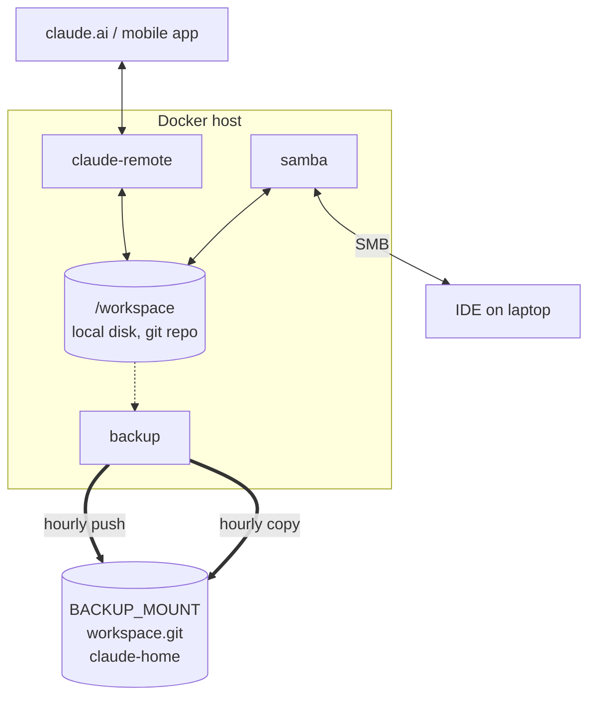

# ai-workspace-remote

An always-on, remotely accessible home for an
[ai-workspace](https://github.com/sebmartin/ai-workspace-plugin) containing the markdown
context across your threads that Claude Code works in.

A workspace like that is just plain files on disk. If that disk is your laptop,
the workspace is only available when the laptop is open and with you: you
cannot pick up a thread from your phone, a second machine sees nothing, and
whether any of it is backed up is a question you would rather not have to
answer.

Move it to a machine that is always running and those problems go away:

- **Work on it from anywhere.** Claude Code runs there in remote-control mode,
  so you drive it from claude.ai or the mobile app, and the session keeps
  going whether or not your laptop is awake.
- **Still just files.** The workspace is exported over SMB, so you browse and
  edit it from a desktop with any editor, exactly as if it were local.
- **Backed up.** A git snapshot goes on a schedule to whatever storage you
  mount for it: a NAS share, a second internal disk, a USB enclosure. Nothing
  has to be installed on it.
- **Not corrupted.** The agent works on local disk, not a network mount. A
  workspace is a git repo, and git over SMB or NFS gets stale `.lock` files
  and non-atomic renames. That damage is silent, and you find it when you
  need the history. Local disk is also much faster.

It is implemented as three containers, Claude Code, Samba and a backup
scheduler, sharing one workspace directory and deployed with Docker Compose.



Solid arrows are writes, dotted are reads.

Session transcripts live in Claude's home rather than the workspace, so they
are copied alongside the repo rather than into it.

## Design constraints

**Nothing is installed on the Docker host.** The backup jobs, the scheduler
and the Samba server all run in containers. There is no host cron, no host
smbd, no host git hook.

**Everything machine-specific lives in `.env` and `secrets/`.** The committed
files carry no paths, hostnames, users or ids from any particular machine.

**It runs from a checkout on the Docker host.** `make up` builds and starts.
There is no registry and no separate image-publishing step.

## Requirements

- A Linux Docker host with Compose v2.
- A workspace directory that is already a git repository.
- Storage for the backup, mounted by the OS before you start. Anything that
  holds files. Mount it with `nofail` so a missing device cannot block boot,
  and NFS with `soft` so an unreachable server cannot wedge processes that no
  timeout can rescue. For cifs, add `uid=` and `gid=` matching the user who
  runs `make init`, or the container will not be able to write.
- An `amd64` host. The backup image pins supercronic to that architecture;
  building elsewhere means changing two build args in `backup/Dockerfile`.
- `jq` on the host if you want `make plugins`.

## Quick start

Clone this onto the Docker host and run it there.

```bash
git clone https://github.com/sebmartin/ai-workspace-remote.git
cd ai-workspace-remote
make init          # asks for what it needs, then does the rest
make up
make login         # one-time: run /login inside the container
```

`make init` creates `.env` for you and asks for anything it cannot work out. It
is idempotent, so run it again any time to re-check a setup.

### What it asks for

Two things, because everything else in `.env` has a working default. Where does
everything live, and where does the backup go.

| variable | what it is |
|---|---|
| `AIWR_ROOT` | one directory holding everything this stack owns |
| `BACKUP_MOUNT` | a directory on storage the OS has already mounted |

Everything else in `.env` has a working default and can be left alone.
`WORKSPACE_UID` and `WORKSPACE_GID` are written by `make init` from whoever
runs it, so they always match the files on disk.

`make init` builds this under `AIWR_ROOT`:

```
$AIWR_ROOT/
  workspace/   the git repo, shared over SMB, where the agent works
  home/        Claude's home, so .claude/ and .claude.json
```

`home/` is a sibling of `workspace/` and not a child, deliberately. Inside the
workspace it would be committed, shared over SMB and copied to the backup.

The backup is not under that root. It lives on `BACKUP_MOUNT`, which holds a
bare `workspace.git` and a `claude-home` directory.

One root also means one value to change to stand up a second, fully isolated
stack, which is how to try this out without pointing anything at a workspace
you care about. The three services set `container_name`, so a test stack and a
real one cannot run at the same time.

### What init does

It creates `.env` if it is missing and asks for anything it needs, creates the
tree, sets ownership and mode, makes `workspace/` a git repo if it is empty,
writes a starter `.gitignore` and `.claude.json`, generates the SMB password,
creates the backup repo, and marks the storage. It stops with a named problem
rather than doing half of it.

`/login` is the only step it cannot do for you.

### How it knows the storage is really there

`init` leaves a `.aiwr-backup` file on `BACKUP_MOUNT`, and every job checks it
before writing.

That matters because an unmounted path is an empty directory, and Docker
creates one if it is missing. Without the check, git and rsync would write to
the Docker host's own disk and report success, and you would find out when you
needed the backup. If the file is gone, the jobs refuse to run and say so in
`WARNINGS.md`.

### Two things worth knowing

**Change anything in `.env`, then run `make up`.** Every setting is either a
volume mount, a port, a hostname, a command or an environment variable, and all
of those are fixed when a container is created. Nothing needs a rebuild.
`make restart` does neither, which is why it is only for picking up a new
Claude version or new commits on the same plugin ref.

**The workspace filesystem needs `user.*` extended attributes.** ext4, xfs and
btrfs are fine. Samba's `streams_xattr` needs them, so pointing `AIWR_ROOT` at
an NFS mount would break the share.

## Connecting over SMB

The share is tuned for macOS and Linux clients. SMB3 is the floor and
encryption is required, which both handle natively.

### Choosing your own password

`make init` generates one into `secrets/smb_password`. To use your own, edit
that file after init has created it:

```bash
$EDITOR secrets/smb_password
docker compose restart samba
```

Editing in place keeps the mode at 0600, and so does a shell redirect onto the
existing file. Creating the file from scratch would leave it 0644. Prefer an
editor over `echo mypassword > ...`, which puts the password in your shell
history. A trailing newline is fine, because the entrypoint reads the file with
a command substitution that strips it. A trailing space is not.

`make init` never overwrites a password that already exists. Samba rebuilds its
passdb from the file on every boot, which is why a restart applies a change.

### Connecting

On macOS, connect with **⌘K → `smb://<host>/workspace`**, user `claude`. The
share will not appear in Finder's sidebar. That is deliberate: NetBIOS is
disabled and there is nothing to discover. Adding Avahi would need host
networking, which conflicts with publishing port 445 explicitly.

Do not disable SMB signing or encryption on the client to "fix" performance.

**Windows.** Nothing here blocks a Windows client. `vfs_fruit` only engages
when a client negotiates the Apple extensions, so it stays out of the way.
Two things in [samba/smb.conf](samba/smb.conf) are worth changing
if Windows is a first-class client: add `Thumbs.db` and `desktop.ini` to
`veto files`, and lower `server min protocol` if you need to support anything
older than Windows 8, which is where SMB3 and encryption arrived.

## Plugins, and pinning one to a branch

Claude installs plugins as `name@marketplace`, only from a registered
marketplace, never straight from a repo URL, and nothing in the CLI takes a
git ref. So the container keeps its own single-entry marketplace on disk and
writes the repo and ref into its manifest. It is rebuilt on every start, so
switching refs needs no cleanup.

The plugin is installed on every start. `PLUGIN_REPO` and `PLUGIN_NAME`
default to the ai-workspace plugin, so the only thing you normally set is the
ref:

```bash
PLUGIN_REF=my-big-revamp        # branch, tag or sha; empty for the default branch
```

```bash
docker compose up -d            # recreate with the new setting
make plugins                    # confirm what is actually live
```

Claude Code does the fetching and caches by resolved sha. Clear `PLUGIN_REF`
and redeploy to go back to the default branch.

Any other plugins you want are installed by hand inside the container with
`claude plugin`, and persist in the mounted `.claude`.

## The device name in claude.ai

The device name is the **container hostname**. Claude Code sends
`os.hostname()` as `machine_name` when it registers, and no environment
variable or config key overrides it. Leave the hostname unset and you get
Docker's generated container ID, which is where a bare hex string comes from.

`CLAUDE_HOSTNAME` sets it. Hostname is fixed when the container is created,
so changing it needs a recreate (`docker compose up -d`), not a restart.

The registration also carries the working directory, so if you ever run a
second stack against a different workspace, give it its own `CLAUDE_HOSTNAME`
or the two are hard to tell apart.

Auto-generated *session* names inside that device get the hostname as a
prefix too, which falls out of the same setting.

## Session survival across restarts

`docker compose restart claude-remote` brings back the sessions the previous
server was serving, for roughly four hours after it stopped. Three things
make that work, and all three are easy to break:

- **The workspace is mounted at `/workspace` and that path is fixed.**
  Transcripts are stored under a directory keyed on the working directory
  with `/` replaced by `-`, so `/workspace` becomes `-workspace`. It is
  hardcoded rather than offered as a setting, because changing it would
  orphan every existing session.
- **`~/.claude` and `~/.claude.json` are persisted.** Transcripts,
  credentials and plugin state live in the first, onboarding and trust in the
  second. `~/.local` is not persisted, so a recreate reverts Claude to the
  image's version.
- **`init: true` plus `exec`.** Without tini, `claude` is PID 1 and discards
  SIGTERM, so every stop waits out the grace period and then SIGKILLs
  mid-transcript.

The entrypoint never passes `--no-create-session-in-dir`, which would forfeit
the re-serve behaviour, and leaves `--name` unset by default for the same
reason.

Check what is on disk with:

```bash
docker compose exec claude-remote ls ~/.claude/projects/-workspace/
```

### How the home is mounted, and the hazard in it

Two paths are bind-mounted individually, `~/.claude` and `~/.claude.json`,
rather than the home directory as a whole. Mounting the whole home would be
better in one respect and impossible in another: it would hide
`/home/claude/.local`, where the image installs Claude and `uv`, and the
container would come up with no `claude` on `PATH`. Claude's native installer
only ever installs into `$HOME` and takes no install-dir override, so there is
no quick way around that.

The cost is real and worth knowing. `~/.claude.json` is rewritten atomically,
as write-temp-then-`rename`. A single-file bind mount pins an *inode*, and
`rename` installs a new one, so after the first rewrite the container can be
reading the old orphaned inode while the host has the new file. This is the
same shape the previous setup ran with, so it is a known-lived-with hazard
rather than a new one, but it is a hazard.

Two consequences follow from `~/.local` not being persisted:

- A `docker compose up -d` recreate reverts Claude to the version baked into
  the image, discarding any background auto-update. Since the README tells you
  to recreate whenever `CLAUDE_HOSTNAME` changes, expect that.
- `make rebuild` is how you actually move the baked-in version forward.

The fix, when it is worth the effort, is to install Claude and `uv` outside
the home and mount the home as one directory.

## Backup and restore

Three jobs, run by supercronic inside the backup container as the workspace
uid, so nothing it writes is root-owned.

| job | default | what it does |
|---|---|---|
| `commit` | hourly | push every branch to `BACKUP_MOUNT`, plus a `backup` ref holding uncommitted work |
| `transcripts` | hourly | copy session transcripts to `BACKUP_MOUNT` |
| `maintain` | weekly | `git fsck` the backup, then `git gc` both repos |

**Uncommitted work goes on a `backup` ref that is rewritten, not appended
to.** It is always exactly `HEAD` plus one commit containing whatever is not
committed yet, so the only blobs it keeps alive are the current uncommitted
diff. Yesterday's half-finished edits become unreachable the moment the ref
moves, and a later `gc` reclaims them. When the worktree is clean the ref just
points at `HEAD`.

Both repos use git's default two-week prune expiry, never `--prune=now`. Git
will not prune an object younger than that precisely so a concurrent writer
that has created an object but not yet pointed a ref at it stays safe, and
relying on that is why these jobs need no locking of their own.

That bounds the cost. A naive append-only snapshot chain would keep every
intermediate state the agent ever wrote, forever, and the only way back would
be rewriting history. Here nothing accumulates beyond a fortnight, so the
schedule is free to be as frequent as you like.

An idle tick does nothing at all. Both commit dates are pinned to the
parent's and the message carries no timestamp, so an unchanged tree hashes to
the same commit every run. The ref does not move and the push is a no-op, with
no bookkeeping needed to work that out.

The job uses git plumbing against a private index, so it never touches your
checked-out branch, your index or `HEAD`, and cannot collide with a git
command you run in the workspace. It pushes by path rather than through a
configured remote, because a remote keeps a tracking ref whose
reflog records every force-push, and those entries would hold every
superseded commit alive in the workspace repo.

The `backup` ref is force-pushed first, then real branches with `--all`,
fast-forward only. Order matters: `--all` legitimately fails after you amend
or rebase a branch that has already been backed up, and pushing it first would
take the snapshot down with it. The job refuses to run if a local branch named
`backup` exists, since that would collide with the ref it force-pushes.

`push --all` runs on every tick, because a commit you make by hand moves a
ref without touching a single file and would otherwise never leave this disk.
It is a no-op when there is nothing new. The job also keeps the backup repo's
`HEAD` pointing at the same branch as the workspace, since `git init --bare`
leaves it at `refs/heads/master` and a clone of the restored copy would
otherwise check out nothing.

**The backup target needs nothing installed on it.** It only ever receives
files. Ordering is git's problem now rather than a copying tool's: `push`
writes objects before the refs that name them, as a protocol guarantee, so
there is no window where the copy references something that is not there yet.

**Git runs against whatever you mounted.** This is the deliberate trade for
not needing SSH. Ref updates on the backup take git's own `.lock` files on
that filesystem, which cifs and nfs handle for a single serialized writer, and
that is what this is. The visible failure mode is a stale
`refs/heads/backup.lock` after an interrupted push, which blocks later pushes
until you delete it. It shows up in `WARNINGS.md`.

**The weekly fsck is not optional**, and it now checks the real backup rather
than a local copy of it. It runs before the repack, not after, because on an
already-corrupt repo a broken ref can make live objects look unreachable and a
repack would then delete them. A failed fsck skips the repack and writes a
warning. Snapshots keep being written, because refusing them would only
guarantee that the newest work exists nowhere.

**Failures are loud, in the place you are already looking.** A failing job
writes `WARNINGS.md` into the root of the workspace, saying what broke and how
to fix it, and deletes it once the job succeeds again. The container also
reports unhealthy while that file exists, but a file in the workspace is seen
by whoever is working there, and an unhealthy container is seen by nobody.

### WARNINGS.md

When a backup job fails it writes `WARNINGS.md` into the root of the
workspace, with a section per failing job saying what broke and the command
that fixes it. The job removes its own section when it next succeeds, and the
file is deleted once the last section goes. Its absence means everything is
working.

It is gitignored, so it never enters a snapshot. That is not tidiness: the
file carries a timestamp, and in the tree it would change the commit every
hour and defeat the no-op idle tick.

### Transcripts are handled separately, and carefully

Session transcripts live in Claude's home, not the workspace, so the git
backup does not cover them. They are copied alongside the repo rather than
into it: they are append-only JSONL that grow steadily, and committing them
every cycle would store a fresh full blob of a growing file each time.

**The rsync filter is an allowlist ending in `--exclude='*'`.** An exclude
list would be correct only for the files that exist today and would silently
start copying anything a future release adds to `~/.claude`. Copied:
`projects/`, `todos/`, `file-history/`, `history.jsonl`, and the two small
plugin manifests. Everything else is excluded by default, including
`.credentials.json`, `settings.json` (which can carry an `env` block with API
keys) and the plugin cache.

No environment variable widens that set. The paths are hardcoded in the
script, the source is mounted read-only, and before every real run a
`--dry-run` pass checks what rsync intends to send and aborts the job if any
filename looks like credential material. Nothing transfers if that trips.

There is no `--delete` on this job: if Claude prunes an old session locally
you still want the copy, which is exactly the case it insures against. The
archive grows, so keep an eye on it.

### Restoring

What lands on the storage is a bare git repository, so:

```bash
git clone $BACKUP_MOUNT/workspace.git restored
```

Transcripts sit next to it under `claude-home/`, ready to copy into a fresh
`$AIWR_ROOT/home/.claude`. Try the clone once before you trust any of this.

## Operations

```bash
make ps          # container status, plus the backup container's health
make logs        # follow
make restart     # restart claude-remote, which is the whole update ritual
make plugins     # which plugin version and ref is live
make init        # set up, or re-check, everything .env describes
make backup-now  # force a snapshot and a transcript copy
make rebuild     # refresh base images and apt packages
make check       # validate the compose file and the shell scripts
```

`make up` builds anything stale and starts the stack, so it is also how you
apply a change to a Dockerfile or an entrypoint.

Use `docker compose exec`, never `docker attach`. Attaching to a `tty: true`
container running the remote-control server drops you into its stdio, and a
stray Ctrl+C stops the server and kills live sessions.

Claude Code auto-updates in the background on the stable channel and the new
version takes effect on next process start, so `make restart` is the update.
Base images, apt packages and `uv` are not covered by that. Run `make rebuild`
occasionally.

## Migrating an existing workspace

If you already have a workspace somewhere else - a laptop directory, a network
share - move it in rather than starting empty.

Do it between `make init` and `make up`.

1. Stop anything that writes to it, and unmount it everywhere it is mounted,
   so nothing writes into the source mid-copy.
2. `rsync -a` the old workspace over `$AIWR_ROOT/workspace`, including its
   `.git`. Copy to the Docker host directly rather than through a laptop that
   has the old location mounted.
3. Run `git status && git log --oneline -5 && git fsck`. All clean before you
   go on. Then `git gc`. A repo that has lived on a network filesystem for
   months will usually repack down a long way.
4. Move the old `~/.claude` and `~/.claude.json` into `$AIWR_ROOT/home`
   so auth, sessions and plugin state carry over.
5. `make init` again. It fixes ownership and modes over what you copied in, and
   leaves the repo and the `.gitignore` alone now that they exist.
6. `make up`.
7. Only then rename the old copy rather than deleting it, and leave it a week.

## Known limitations

**Two uncoordinated writers.** Claude and whoever is editing over SMB can
both write the same file.
Oplocks and SMB2 leases are disabled so a client cannot serve stale cached
data for a tree the container writes behind Samba's back, but that prevents
stale reads, not lost updates. There is no fix at this layer. The hourly
snapshot is the safety net.

**If the storage is not mounted, nothing is backed up anywhere.** There is no
intermediate copy on the Docker host to fall back on. The `.aiwr-backup`
marker is what makes that loud rather than silent: the jobs refuse to run and
`WARNINGS.md` says so. But if you unmount the storage and ignore the warning,
snapshots simply stop.

**The agent can delete the workspace's git history.** `.git` lives inside the
tree and the backup container runs as the same uid Claude does, so nothing
prevents it. The copy on `BACKUP_MOUNT`, up to an hour stale, is the recovery.
Moving the git directory somewhere the session cannot reach is real work and
is deferred.

**One disk holds the live copy.** The Docker host's disk is a single point of
failure. The backup is an hourly RPO plus git's integrity checking, not
replication. That is a reasonable trade for text you can regenerate a few
minutes of, and a bad one if you were expecting redundancy. If the workspace
previously lived on a NAS with RAID, be aware you have traded that for this.
Whether the backup is on a different machine is now your choice, since any
mount will do. A second internal disk does not survive what takes the box out.

**`secrets/` and `.env` are the security perimeter.** `secrets/` holds the SMB
password, `.env` holds paths. Both are gitignored.

## Troubleshooting

| symptom | cause |
|---|---|
| Device shows as a hex ID in claude.ai | `CLAUDE_HOSTNAME` unset, or the container was restarted rather than recreated |
| Sessions do not come back after a restart | more than ~4h elapsed |
| `make plugins` shows `enabled: false` | the same plugin name is installed from two marketplaces |
| Stop takes the full grace period | SIGTERM is not reaching claude, check `init: true` |
| Share not visible in Finder | expected, connect with ⌘K, there is no discovery |
| Backup container unhealthy | read `WARNINGS.md` in the workspace, which says which job failed and why |
| `dest_missing` in the logs | `BACKUP_MOUNT` has no `.aiwr-backup` marker, so the storage is not mounted. Mount it, then `make init` |
| `cannot lock ref 'refs/heads/backup'` | a stale `.lock` in `$BACKUP_MOUNT/workspace.git` after an interrupted push. Delete it |
| `guard_tripped` in the logs | the transcript filter would have sent credential material, so nothing was transferred |

## License

MIT. See [LICENSE](LICENSE).
